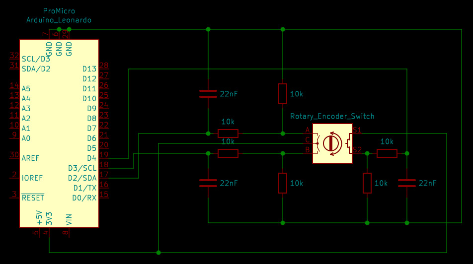
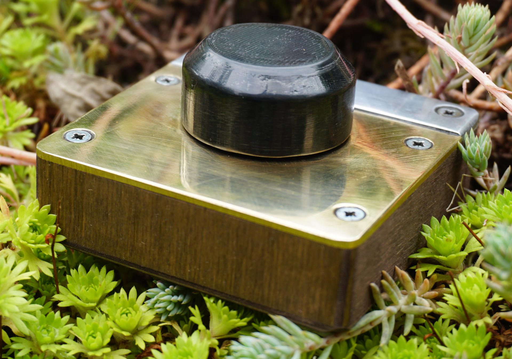

# Knob-Louder
PlatformIO project for the Arduino Micro which turns it into a USB HID Volume Controller for any PC.

## Flashing the firmware

This repository contains a `platformio.ini`. It should suffice to open the project in PlatforIO and click on upload.

If the direction is reversed you can switch the pin numbers at the `#define`s instead of switching the cables at pin 2 and 3.

You can use the ArduinoIDE: Just copy the code from `src/main.cpp` to your sketch and select "Arduino Micro" as your board.

## Soldering the PCB

There are only a few components needed apart from the encoder: Left, right an the switch each use a 10k pull down resistor and load a small 22nF capacitor over another 10k resistor. The capacitor debounces the switches in the encoder.

Feel free to switch to other pins if your project adds more components. Pin 2 to 4 are fine on the Arduino Micro and Pro Micro. A Leonardo should work fine too but does not fit in the case below.

## Building a case

There is a technical drawing for a case in steampunk style for the device [in the CAD-Files folder](https://github.com/pinae/Knob-Louder/blob/master/CAD-Files/Case-TechnicalDrawing.pdf).

The STL file for the 3D printed knob is [here](https://github.com/pinae/Knob-Louder/blob/master/CAD-Files/Knopf.stl).

